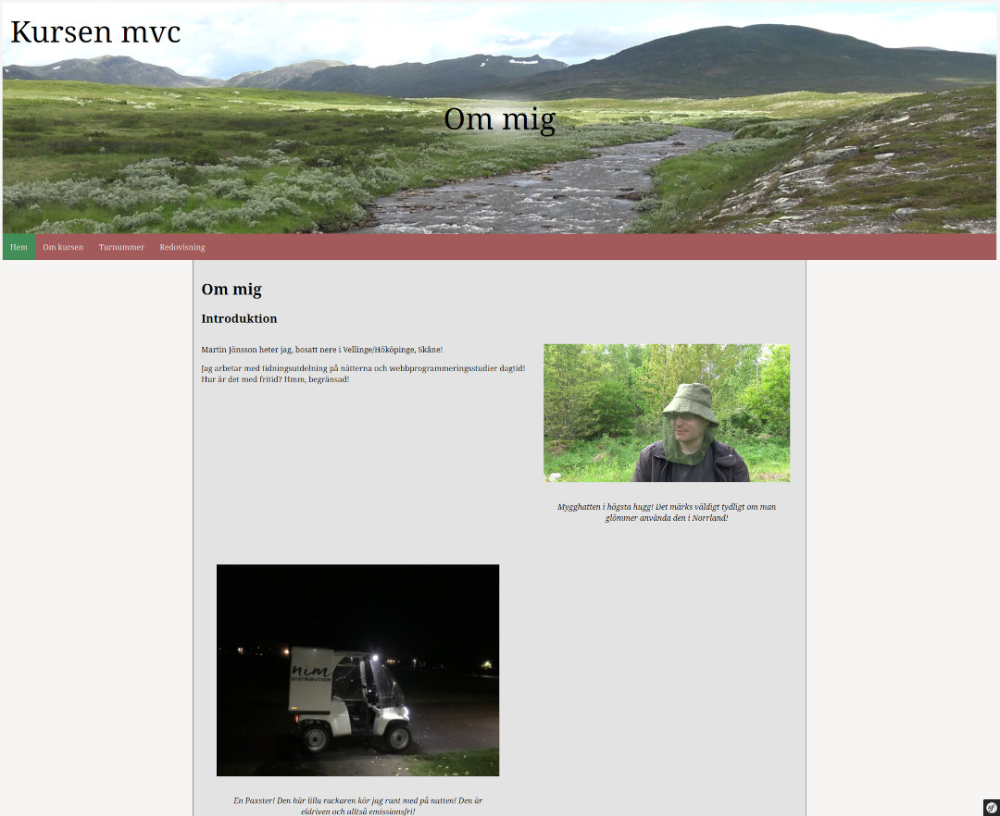

Requirements
============

- [npm][npm]
- [php 8.3][php]
- php-xml
- [composer][composer]
- [symfony][symfony]

Please refer to your operating system for instructions in installing these components.

How to install
==============

```
git clone https://github.com/annoyingkid86/mvc
npm install
composer install
```

How to compile
==============

```
npm run build
```

How to run
==========

Example given, localhost on port 8888

```
php -S localhost:8888 -t public
```

In your browser, type: http://localhost:8888/

To stop server, use ctrl+c

[composer]: https://getcomposer.org/
[npm]: https://docs.npmjs.com/downloading-and-installing-node-js-and-npm
[php]: https://www.php.net/
[symfony]: https://symfony.com/